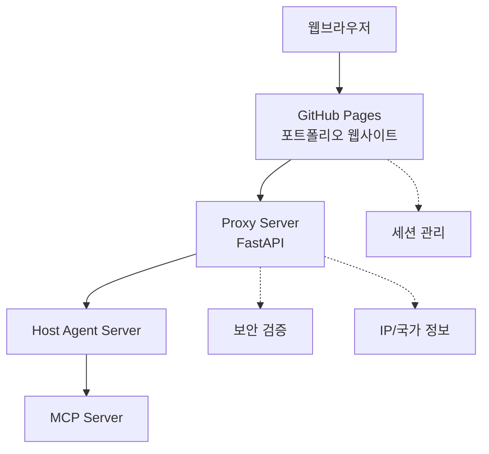

## WebAgentic은 Web3 시대를 위한 탈중앙화 지능형 에이전트 플랫폼입니다.

사용자가 질문하면 에이전트가 실시간 응답하고, HTML·Markdown 페이지를 자동 생성해 정보를 제공합니다. 
분산 네트워크와 자율형 에이전트 기술을 중심으로 혁신적인 웹 환경을 구현합니다.  

이 프로젝트는 4개의 분리된 저장소로 구성된 마이크로서비스 아키텍처를 사용합니다 
1. **웹페이지 Server** - GitHub Pages를 통한 정적 [웹사이트](https://kimdonghwi94.github.io/dhkim/) (Public) 
2. **Proxy Server** - FastAPI 기반 중간 서버 (Private)
3. **Host Agent Server** - 에이전트 호스팅 서버 (A2A Protocol) (Public) - 예정
4. **MCP Server** - Model Context Protocol 서버 (Server & Local) (Public) - 예정

<!--

**Here are some ideas to get you started:**

🙋‍♀️ A short introduction - what is your organization all about?
🌈 Contribution guidelines - how can the community get involved?
👩‍💻 Useful resources - where can the community find your docs? Is there anything else the community should know?
🍿 Fun facts - what does your team eat for breakfast?
🧙 Remember, you can do mighty things with the power of [Markdown](https://docs.github.com/github/writing-on-github/getting-started-with-writing-and-formatting-on-github/basic-writing-and-formatting-syntax)
-->
